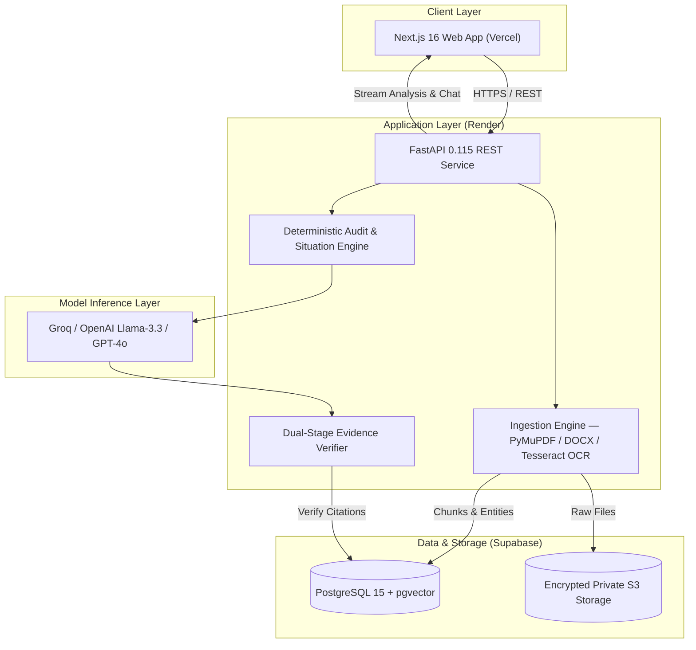

<div align="center">

# ⚖️ LegalLens
### Deterministic AI Legal Document Risk & Action Navigator

**Turning opaque legal contracts into evidence-grounded, actionable intelligence — with zero hallucination tolerance.**

[](https://legal-lens-tan.vercel.app)
[](https://legal-lens-api-6obh.onrender.com/api/v1/health)
[](LICENSE)

[Live App](https://legal-lens-tan.vercel.app) • [API](https://legal-lens-api-6obh.onrender.com/api/v1/health) • [Architecture](docs/ARCHITECTURE.md) • [Repo](https://github.com/rachit101-cell/Legal-Lens)

</div>

---

## 🧩 The Problem

Legal agreements — NDAs, MSAs, vendor contracts, terms of service — are dense, ambiguous, and expensive to review. Generic LLM tools make this worse, not better: they **hallucinate clauses, invent obligations, and fail silently** on ambiguous language. For individuals and small businesses without in-house counsel, that's a real liability, not a convenience.

## 💡 Our Solution

**LegalLens** is a dual-stage, evidence-verified AI pipeline that converts any legal document into a structured **Legal Situation Map** — every risk, obligation, and deadline traced back to a verbatim clause with page-level citations. If a claim can't be proven from the source text, the system **refuses to guess** rather than risk a fabricated answer.

> *LegalLens is a legal analysis and information-extraction tool — not a substitute for licensed legal counsel.*

---

## ✨ What It Does

| Capability | Description |
| :--- | :--- |
| 🔍 **Deterministic Evidence Layer** | Extracts sentence-level clauses with exact page numbers, section paths, and SHA-256 integrity hashes |
| 🛡️ **Dual-Stage Verification** | An independent validation pass checks every AI finding against cited source text before it's shown to the user |
| 🚨 **Severity-Triaged Risk Audit** | Flags high/medium/low risks — uncapped liability, missing dispute clauses, asymmetric indemnification, shortened survival windows |
| 🕸️ **Party & Obligation Graph** | Breaks multi-party contracts into per-entity duties, rights, and covenants |
| 📅 **Contractual Timeline Engine** | Surfaces effective dates, notice windows, termination triggers, and renewal deadlines as an actionable schedule |
| 📝 **Attorney-Ready Redlines** | Suggests proposed clause revisions and prep questions for legal counsel |
| 💬 **Grounded Chat** | Ask questions in plain English; every answer returns verbatim quotes, page coordinates, and a confidence score |
| 🔒 **Zero Data Retention** | Documents processed ephemerally; encrypted at rest (AES-256) and in transit (TLS 1.3) |

---

## 🏗️ How We Built It



### Tech Stack

**Frontend** — Next.js 16, TypeScript, App Router, Vercel
**Backend** — FastAPI 0.115, Python 3.11+, Render
**Data** — PostgreSQL 15 + `pgvector` (Supabase), encrypted S3-compatible storage
**AI/ML** — Hosted structured-output LLMs (Groq / OpenAI Llama-3.3 / GPT-4o), custom dual-stage evidence verifier
**Document Processing** — PyMuPDF, python-docx, Tesseract OCR
**Infra/Dev** — Docker Compose (local Postgres, MinIO, Redis), Alembic migrations

### Project Structure

```text
legallens/
├── apps/
│   ├── api/            # FastAPI backend — ingestion, analysis, chat, auth
│   └── web/            # Next.js 16 frontend — upload, dashboard, chat UI
├── packages/
│   ├── schemas/        # Shared Pydantic domain models
│   └── prompts/        # Versioned prompt engineering templates
├── docs/               # Architecture, PRD, design specs
└── docker-compose.yml  # Local dev infra (Postgres, MinIO, Redis)
```

---

## 🧗 Challenges We Ran Into

- **Killing hallucinations, not just reducing them.** A single unverified clause could mean real legal exposure for a user, so "mostly accurate" wasn't good enough — we built a dedicated verification pass that cross-checks every generated claim against the original source text before it ever reaches the UI.
- **Making refusal a feature, not a failure.** Tuning the system to confidently say "I can't verify this from the document" instead of guessing required rethinking prompt design and response schemas from the ground up.
- **Grounding chat responses in real coordinates.** Mapping natural-language answers back to exact page numbers and section paths (not just "somewhere in the document") took a custom chunking and indexing layer on top of `pgvector`.
- **Security under time pressure.** Implementing zero data retention, AES-256 encryption, and strict CORS/secret isolation while still shipping fast for the hackathon deadline.

## 🏆 Accomplishments We're Proud Of

- Shipped a **fully deployed, end-to-end product** — not a notebook demo — with a live frontend, production API, and managed database.
- Built a genuinely novel **dual-stage evidence verification protocol** that other legal-AI tools in this space don't implement.
- Achieved a **strict refusal guarantee**: the system will not present a finding it cannot cite.
- Delivered a complete situation map (risks, obligations, timeline, redlines, chat) rather than a single-purpose summarizer.

## 🔭 What's Next

- Multi-document comparison (redline diffing across contract versions)
- Jurisdiction-aware risk scoring
- Team/workspace collaboration and shared annotations
- Native e-signature and clause-negotiation workflow integration

---

## ⚡ Quick Start

### Prerequisites
Python 3.11+ · Node.js 18+ (20+ recommended) · Docker & Docker Compose

```bash
# Clone
git clone https://github.com/rachit101-cell/Legal-Lens.git
cd Legal-Lens
cp .env.example .env

# Local infra
docker compose up -d postgres minio redis

# Backend
cd apps/api
python -m venv .venv && source .venv/bin/activate
pip install -r requirements.txt
alembic upgrade head
python run.py            # → http://localhost:8000

# Frontend (new terminal)
cd apps/web
npm install
npm run dev               # → http://localhost:3000
```

---

## 📡 API Reference

| Method | Endpoint | Description |
| :--- | :--- | :--- |
| `GET` | `/api/v1/health` | Service liveness check |
| `GET` | `/api/v1/health/ready` | Readiness probe (DB & dependencies) |
| `POST` | `/api/v1/documents/upload` | Upload PDF/DOCX (up to 20MB) |
| `GET` | `/api/v1/documents/{id}` | Ingestion status & metadata |
| `GET` | `/api/v1/documents/{id}/pages` | Page-by-page extracted text & layout |
| `POST` | `/api/v1/analysis/{id}/run` | Trigger situation map analysis |
| `GET` | `/api/v1/analysis/{id}` | Retrieve findings, obligations, timeline |
| `POST` | `/api/v1/chat/{id}/message` | Ask grounded questions with citations |

---

## 🔒 Security & Privacy

- **No model training** on customer documents
- **Read-only** analysis models over retrieved chunks only
- **TLS 1.3** in transit, **AES-256** at rest
- **Zero data retention** — documents processed ephemerally

---

## 🧪 Testing

```bash
# Backend
cd apps/api && pytest tests/ -v

# Frontend
cd apps/web && npm run build && npm run lint
```

---

## 👥 Team

Built by the **LegalLens Engineering Team**.

## 📄 License

Distributed under the **MIT License**. See [LICENSE](LICENSE) for details.

<div align="center">
<sub>⚖️ Deterministic where possible · AI where useful · Evidence always · Uncertainty when necessary · Security by design</sub>
</div>
